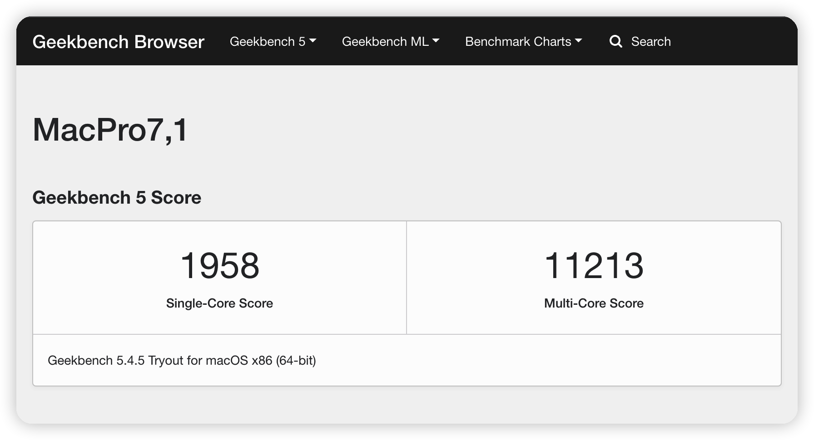
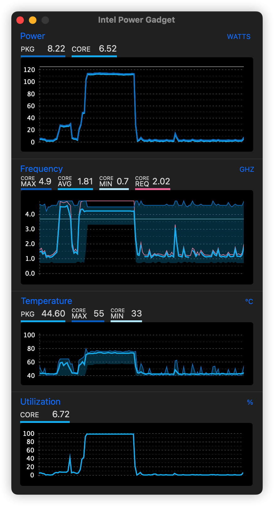

# MSI-MAG-B660M-MORTAR-DDR4-12600K-EFI
微星B660m迫击炮D4版（不带wifi） + 12600K EFI。

## 配置

| 配置 | 型号 |
| --- | --- |
| CPU | [Intel i5 12600K](https://ark.intel.com/content/www/cn/zh/ark/products/134589/intel-core-i512600k-processor-20m-cache-up-to-4-90-ghz.html) |
| 主板 | [微星MAG B660M MORTAR DDR4](https://cn.msi.com/Motherboard/MAG-B660M-MORTAR-DDR4) |
| 显卡 | [华硕AREZ-RX560-O2G-EVO](https://www.asus.com/motherboards-components/graphics-cards/arez/arez-rx560-o2g-evo/) -> [撼讯RX5600XT红龙](https://www.powercolor.com/cn/product?id=1577415960) |
| 内存 | 宇瞻黑豹DDR4 3600 8Gx2 |
| 网卡 | BCM94360CD 4 天线 |
| 硬盘 | [Samsung SSD 970 EVO Plus 500GB](https://www.samsungeshop.com.cn/product/MZ-V7S/MZ-V7S250BW) |
| OC版本 | 0.8.5 |
| macOS | macOS Ventura 13.2.1 (22D68) |
| 机型 | MacPro7,1 |

## 更新记录
### 2023-03-05

- 更新opencore 0.8.9
- 系统更新到Ventura 13.2.1
- 更换了撼讯RX5600XT红龙显卡，启动参数添加了agdpmod=pikera以支持rx5000/rx6000系列显卡（rx560显卡自行去除该参数）

### 2022-12-12

- 更新opencore 0.8.7

### 2022-11-04

- 系统更新到Ventura 13.0

### 2022-10-04

- 更新opencore 0.8.5
- 系统更新到12.6

### 2022-08-02

- 更新opencore 0.8.3
- 系统更新到12.5

添加了CpuTopologyRebuild.kext，可以正确识别12600K为10核16线程。

### 2022-07-07

- 更新opencore 0.8.2
- 系统更新到12.4 （正式版的通用控制稳定多了）

另外如果BIOS开启“USB设备从S3/S4/S5唤醒”会导致关机状态下动一下鼠标就自动开机。需要同时打开ERP-Ready。感谢 [lyq1996](https://github.com/lyq1996) 的[提醒](https://github.com/yzchan/MSI-MAG-B660M-MORTAR-DDR4-12600K-EFI/commit/537c90d81cd98eafe2ab5ab3f6e989cfa87afcdd)。

### 2022-06-12

- 更新opencore 0.8.1
- 解决了睡眠唤醒问题，原来是BIOS没设置好：Setting > 高级 > 唤醒事件设置 > USB设备从S3/S4/S5唤醒 【允许】
- ⚠️ EFI设置了随机三码，如需使用，请自行更换
- 增加ResetNvramEntry.efi和ResetNvramEntry.efi（UEFI > Driviers）

### 2022-05-30
使用SSDTTime提取了SSDT，重新编译了EC-USBX.aml

### 2022-05-21

- 定制了USB，睡眠久一点需要按电源键才能唤醒
- 隔空投送正常，通用控制也可以使用
- Geekbench5跑分正常

### 2022-05-18
正常进入系统，蓝牙、wifi、声卡、网卡正常。appid登录正常。其他功能待测试。

## BIOS设置

- 关闭CSM（启动模式仅UEFI）
- 关闭快速开机 Fast Boot
- 关闭MSI快速开机
- 关闭Intel VT-D
- 关闭CFG Lock
- 最好屏蔽核显
- 大小核均可开启
- 超线程可开启

## 12代EFI整理

- https://zhuanlan.zhihu.com/p/487736399
- https://github.com/alyxferrari/OpenCore-Install-Guide/blob/alderlake/config.plist/alder-lake.md
- https://github.com/duxphp/Hackintosh-12700KF-B660M-MORTAR-6600XT
- https://github.com/Xmingbai/ASUS-TUF-GAMING-B660M-PLUS-Wi-Fi-D4-Hackintosh
- https://heipg.cn/tutorial/b660m-install-macos.html/comment-page-1
- https://www.bilibili.com/video/BV1nm4y1R7Mh
- https://bbs.pcbeta.com/viewthread-1928907-1-1.html

其他配置请戳 [>>黑果小兵<<](https://github.com/daliansky/Hackintosh)

## Links

- [OC Auxiliary Tools](https://github.com/ic005k/QtOpenCoreConfig)
- [ProperTree](https://github.com/corpnewt/ProperTree)
- [Hackintool](https://github.com/headkaze/Hackintool)
- [OpenCore](https://dortania.github.io/OpenCore-Install-Guide/prerequisites.html)
- [OpenCorePkg](https://github.com/acidanthera/OpenCorePkg)
- https://blog.daliansky.net/
- https://apple.sqlsec.com/
- https://space.bilibili.com/16323318/channel/collectiondetail?sid=296068
- https://bbs.pcbeta.com/forum.php?gid=86
- https://www.tonymacx86.com/
- https://github.com/daliansky/OC-little
