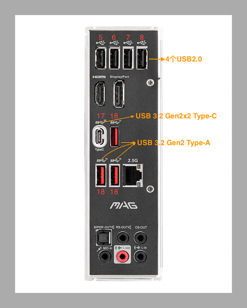

# USB定制(MSI MAG-B660M-MORTAR-DDR4)

MSI MAG-B660M-MORTAR-DDR4的USB接口数据如下

Intel® B660 Chipset
- 1x USB 3.2 Gen2x2 20Gbps Type-C port on the back panel
- 1x USB 3.2 Gen 2 10Gbps Type-C port available through the internal connector
- 2x USB 3.2 Gen 1 5Gbps ports available through the internal connector
- 4x USB 2.0 ports on the back panel

USB Hub-GL3590
- 3x USB 3.2 Gen 2 10Gbps Type-A ports on the back panel

USB Hub-GL850G
- 4x USB 2.0 ports available through internal connectors

## 后面板USB



上面一排4个USB2.0接口分别对应端口⑤、⑥、⑦、⑧。

type-c口速率为20Gbps，对应usb3.0端口①⑦，usb2.0端口①。type-c的USB2.0端口几乎没用，可以删除

下面的3个type-a口速率为10Gbps，他们的端口都是①⑧，就是上面接口数据里面的USB Hub-GL3590。对应USB2.0端口为③。

## 主板USB

主板上有4个USB接口，cpu下方两个，右侧两个。

- JUSB1:    USB2.0
- JUSB2:    USB2.0
- JUSB3:    USB3.2 Gen 1 (5Gbps)
- JUSB4:    USB3.2 Gen 2 Type-c接口(10Gbps)

JUSB1和JUSB2都是USB2.0接口，个人的JUSB1接了奋威T919的蓝牙，JUSB2接前面板的USB2.0接口。

JUSB3接前面板的USB3.0接口。

JUSB4是闲置的，因为我的机箱不带type-c接口。

## USBToolBox

USBToolBox（Window10）发现的全部端口

```txt
  #######################################################
 #                  Port Discovery                     #
#######################################################

Intel(R) USB 3.20 可扩展主机控制器 - 1.20 (Microsoft) | USB 3.0 (XHCI) | 25 ports
  Port 1 | USB 2.0 | Type C - with switch (guessed)
  Port 2 | USB 2.0 | Internal (guessed)
    - MYSTIC LIGHT - operating at USB 1.1
  Port 3 | USB 2.0 | Internal (guessed)
    - USB2.1 Hub - operating at USB 2.0
  Port 4 | USB 2.0 | Type C - with switch (guessed)
  Port 5 | USB 2.0 | Type A (guessed)
    - USB 2.0 Hub - operating at USB 2.0
      - USB DEVICE - operating at USB 1.1
      - Razer DeathAdder - operating at USB 1.1
  Port 6 | USB 2.0 | Type A (guessed)
  Port 7 | USB 2.0 | Type A (guessed)
  Port 8 | USB 2.0 | Type A (guessed)
  Port 9 | USB 2.0 | USB 3 Type A (guessed)
  Port 10 | USB 2.0 | USB 3 Type A (guessed)
  Port 11 | USB 2.0 | Internal (guessed)
    - USB2.0 Hub - operating at USB 2.0
      - BRCM20702 Hub - operating at USB 1.1
        - Bluetooth USB Host Controller - operating at USB 1.1
  Port 12 | USB 2.0 | Internal (guessed)
  Port 13 | USB 2.0 | Internal (guessed)
  Port 14 | USB 2.0 | Internal (guessed)
  Port 15 | USB 2.0 | Type A (guessed)
  Port 16 | USB 2.0 | Type A (guessed)
  Port 17 | USB 3.0 | Type C - with switch (guessed)
  Port 18 | USB 3.0 | Internal (guessed)
    - USB3.2 Hub - operating at USB 3.1 Gen 2
  Port 19 | USB 3.0 | Type C - with switch (guessed)
  Port 20 | USB 3.0 | Internal (guessed)
  Port 21 | USB 3.0 | Internal (guessed)
  Port 22 | USB 3.0 | Internal (guessed)
  Port 23 | USB 3.0 | Internal (guessed)
  Port 24 | USB 3.0 | USB 3 Type A (guessed)
  Port 25 | USB 3.0 | USB 3 Type A (guessed)

```

### UsbConnector


```txt
  #######################################################
 #                     USB Types                       #
#######################################################

Type A: 0
Type Mini-AB: 1
ExpressCard: 2
USB 3 Type A: 3
USB 3 Type B: 4
USB 3 Type Micro-B: 5
USB 3 Type Micro-AB: 6
USB 3 Type Power-B: 7
Type C - USB 2 only: 8
Type C - with switch: 9
Type C - without switch: 10
Internal: 255

The difference between connector types 9 and 10 is if you reverse the plug and the devices are connected to the same ports as before, they have a switch (type 9).
If not, and they are connected to different ports, they do not have a switch (type 10).

For more information and pictures, go to https://github.com/USBToolBox/tool/blob/master/TYPES.md.
```

## 端口整理

| Port | Companion | 描述                |
|------|-----------|-------------------|
| 1    | 17        | 后面板Type-C(USB2.0) |
| 2    |           | MSI灯效调节功能         |
| 3    | *18       | 后面板Type-A(USB2.0) |
| 4    | 19        | JUSB4(USB2.0)     |
| 5    |           | 后面板USB2.0         |
| 6    |           | 后面板USB2.0         |
| 7    |           | 后面板USB2.0         |
| 8    |           | 后面板USB2.0         |
| 9    | 24        | JUSB3 (USB2.0)    |
| 10   | 25        | -                 |
| 11   |           | JUSB1/JUSB2       |
| 12   |           | -                 |
| 13   |           | -                 |
| 14   |           | -                 |
| 15   |           | -                 |
| 16   |           | -                 |
| 17   | 1         | 后面板Type-C         |
| 18   | *3        | 后面板Type-A         |
| 19   | 4         | JUSB4(USB3.0)     |
| 20   |           | -                 |
| 21   |           | -                 |
| 22   |           | -                 |
| 23   |           | -                 |
| 24   | 9         | JUSB3             |
| 25   | 10        | -                 |

25个可用端口中只用到了14个。其中1号端口和4号端口都是Type-C对应的USB2.0端口，基本上是用不到的，可以删除。19号端口是主板上的Type-C接口，机箱前面板没有Type-C接口的话也可以选择性删除。不过这里一共也没有超过15个，所以全部定制了这14个端口。